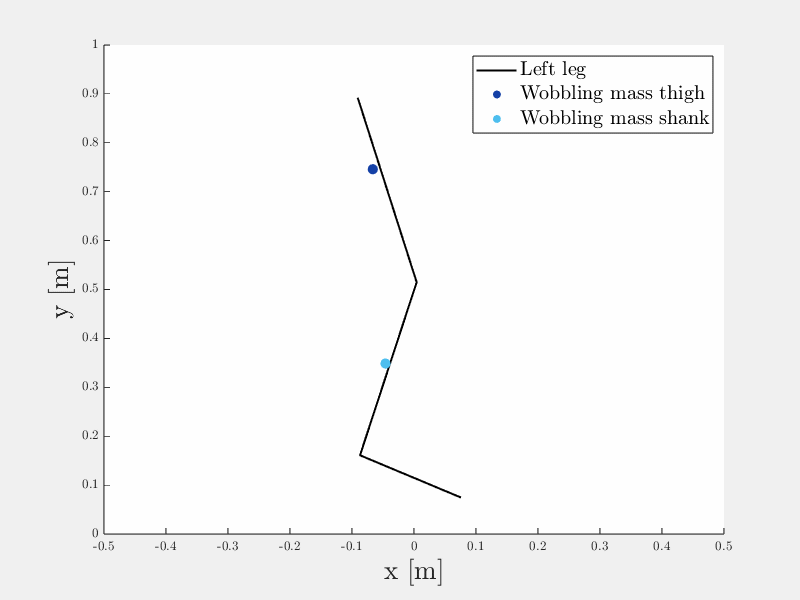

## **Motion capture (Vicon) - force plate - inverse dynamics - wobbling mass model**

For the lecture *multiperspective movement analysis* we recorded motion capture data using a Vicon system simultaneously with force plate data to calculate inverse dynamics of the lower limb in Matlab. We extended this with a wobbling mass model in Simulink.

For the lecture, we carried out a drop jump:


In the project, we extended this with a more detailed comparison of a squat jump vs. a countermovement jump.

To run, simply execute the Matlab files 'Vicon_inverseDynamics.m' and/or 'inverseDynamics_comparison_SQ_CM.m'

## Folder Structure 
```
│projectdir                      <- Main folder
|
├── lecture                      <- Analysis of drop jump carried out as part of the lecture
│   ├── dropJump.gif             <- Gif showing lower limb segments during drop jump and wobbling mass 
│   │                               movement
│   ├── Gelenksdaten.xlsx        <- Vicon motion capture data
│   ├── GRFundCoP.xlsx           <- Force plate data
│   ├── Vicon_inverseDynamics.m  <- Matlab script for calculation of inverse dynamics of the lower limb
│   ├── WobblingMassModel.slx    <- Simulink model for wobbling masses of the thigh and lower leg
│
├── project                      <- Group project for comparison of squat jump vs. countermovement jump
│   ├── countermovementJump.gif  <- Gif showing countermovement jump and wobbling mass movement
│   ├── Gelenksdaten06.xlsx      <- Vicon motion capture data for squat jump
│   ├── Gelenksdaten08.xlsx      <- Vicon motion capture data for countermovement jump
│   ├── GRFundCoP06.xlsx         <- Force plate data for squat jump
│   ├── GRFundCoP08.xlsx         <- Force plate data for countermovement jump
│   ├── inverseDynamics_comparison_SQ_CM.m   <- Matlab script
│   ├── presentation.pdf         <- Final presentation
│   ├── squatJump.gif            <- Gif showing squat jump and wobbling mass movement
│
├── README.md        <- Top-level README.
```